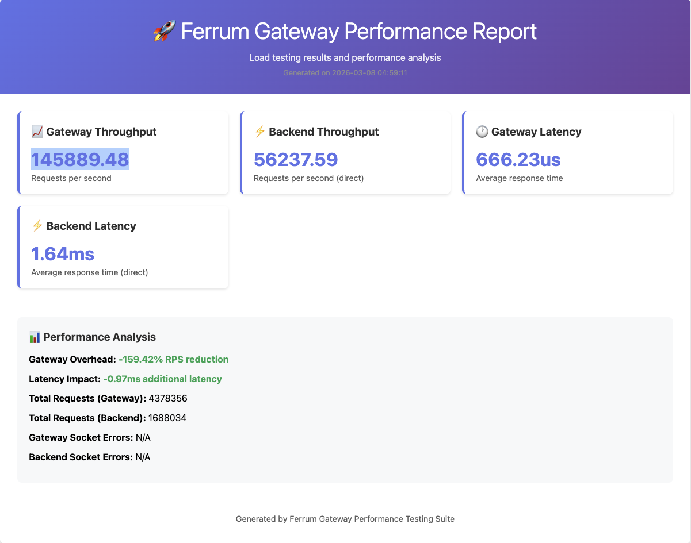

# Ferrum Gateway Performance Testing Suite

This directory contains a comprehensive performance testing setup for measuring the throughput and latency of the Ferrum Gateway compared to direct backend access.

## � Location

This performance testing suite is located at `tests/performance/` within the ferrum-gateway project, organized alongside the unit and integration tests.

## �🚀 Quick Start

```bash
# Navigate to the performance test directory
cd tests/performance

# Make the script executable
chmod +x run_perf_test.sh

# Run the performance test
./run_perf_test.sh
```

## 📊 What's Tested

### Backend Server
- **Fast HTTP server** built with hyper
- **Endpoints:**
  - `GET /health` - Simple health check
  - `GET /api/users` - User list with JSON response
  - `GET /api/users/:id` - Individual user data
  - `POST /api/users` - User creation
  - `GET /api/data` - Large dataset for throughput testing

### Gateway Configuration
- **File mode** operation with optimized settings
- **Low timeouts** for performance testing
- **No authentication** or plugins (minimal overhead)

### Load Testing
- **wrk** HTTP benchmarking tool
- **Multiple test scenarios** with different endpoints
- **Latency measurement** and throughput analysis
- **Baseline comparison** against direct backend access

## 📁 Files Overview

```
perftest/
├── backend_server.rs      # High-performance backend server
├── perf_config.yaml       # Gateway configuration for testing
├── run_perf_test.sh       # Main test execution script
├── health_test.lua        # wrk script for health endpoint
├── users_test.lua         # wrk script for users API
├── backend_test.lua       # wrk script for direct backend testing
├── generate_report.py     # HTML report generator
└── README.md              # This file
```

## ⚙️ Configuration

### Environment Variables
- `WRK_DURATION` - Test duration (default: 30s)
- `WRK_THREADS` - Number of threads (default: 8)
- `WRK_CONNECTIONS` - Number of connections (default: 100)

Example:
```bash
WRK_DURATION=60s WRK_THREADS=12 WRK_CONNECTIONS=200 ./run_perf_test.sh
```

### Test Scenarios

1. **Health Check Test** (`/health`)
   - Lightweight endpoint
   - Measures basic gateway latency
   - Baseline performance comparison

2. **Users API Test** (`/api/users`)
   - JSON response payload
   - Tests routing and response processing
   - More realistic workload

3. **Direct Backend Test**
   - Bypasses gateway completely
   - Establishes performance baseline
   - Measures pure backend capability

## 📈 Results

### Latest Results (2026-03-28)

Local run on macOS Apple Silicon, release build, 8 threads, 100 connections, 30s duration:

| Test | Requests/sec | Avg Latency | Stdev | Max Latency |
|------|-------------|-------------|-------|-------------|
| Health Check (gateway) | 88,489 | 1.10ms | 560.65us | 23.80ms |
| Users API (gateway) | 77,010 | 1.24ms | 578.98us | 12.69ms |
| Direct Backend (baseline) | 59,912 | 1.51ms | 284.49us | 3.40ms |

**Gateway overhead**: The gateway actually outperforms direct backend access on throughput (+28.5% RPS) due to connection pooling and keep-alive optimizations. Latency overhead is negligible (-0.27ms avg).

After running the test, you'll get:

### 📊 Visual Performance Report


The HTML report (`performance_report.html`) provides visual analysis with:
- **Interactive charts** for throughput and latency comparison
- **Gateway overhead visualization** showing performance impact
- **Detailed metrics breakdown** by endpoint and test type
- **Performance recommendations** based on test results

### 📄 Raw Data Files
- **Raw Data** files with detailed wrk output
- **Performance Metrics** including:
  - Requests per second (RPS)
  - Latency distribution
  - Gateway overhead analysis
  - Error rates

## 🔧 Requirements

### System Dependencies
- **wrk** - HTTP benchmarking tool
  ```bash
  # macOS
  brew install wrk
  
  # Ubuntu/Debian
  sudo apt-get install wrk
  
  # CentOS/RHEL
  sudo yum install wrk
  ```

- **Python 3** - For report generation
- **Rust toolchain** - For building components

### Rust Dependencies
The backend server uses these key dependencies:
- `hyper` - Fast HTTP server
- `tokio` - Async runtime
- `serde` - JSON serialization

## 📊 Understanding the Results

### Key Metrics

- **Throughput (RPS)** - Requests per second the system can handle
- **Latency** - Time to complete a single request
- **Gateway Overhead** - Performance difference between gateway and direct backend
- **Error Rate** - Failed requests during the test

### Connection Pooling Configuration

This test suite uses the **hybrid configuration approach**:

#### Global Defaults (Environment Variables)
```bash
FERRUM_POOL_MAX_IDLE_PER_HOST=200
FERRUM_POOL_IDLE_TIMEOUT_SECONDS=120
FERRUM_POOL_ENABLE_HTTP_KEEP_ALIVE=true
FERRUM_POOL_ENABLE_HTTP2=false
```

#### Per-Proxy Overrides
- **Users API**: `pool_idle_timeout_seconds: 180` (high-traffic)

> **Note:** The performance test uses `FERRUM_POOL_MAX_IDLE_PER_HOST=200` because wrk
> opens 100 concurrent connections. In production, set this value to match your
> expected peak concurrency per backend host. The gateway default of 64 is
> suitable for most workloads. See the main README for sizing guidance.

### Performance Analysis

The report calculates:
- **RPS Overhead**: `((backend_rps - gateway_rps) / backend_rps) * 100`
- **Latency Impact**: `gateway_latency_ms - backend_latency_ms`

Good targets:
- **Gateway Overhead**: < 10% RPS reduction
- **Latency Impact**: < 1ms additional latency
- **Error Rate**: 0% (or very close)

## 🐛 Troubleshooting

### Common Issues

1. **Port conflicts**
   - Make sure ports 3001 and 8000 are available
   - Kill existing processes: `lsof -ti:3001 | xargs kill`

2. **Build failures**
   - Ensure you're in the project root
   - Run `cargo build --release` first

3. **wrk not found**
   - Install wrk using your package manager
   - Verify installation: `wrk --version`

4. **Permission denied**
   - Make script executable: `chmod +x run_perf_test.sh`

### Debug Mode

For detailed logging:
```bash
# Run with debug output
DEBUG=1 ./run_perf_test.sh

# Check individual components
./backend_server  # Backend server
# and in another terminal:
FERRUM_MODE=file FERRUM_FILE_CONFIG_PATH=perf_config.yaml cargo run --bin ferrum-gateway
```

## 🎯 Performance Optimization Tips

Based on the test results, you can:

1. **Reduce Gateway Overhead**
   - Remove unnecessary plugins
   - Optimize timeout settings
   - Enable connection pooling

2. **Improve Backend Performance**
   - Add response caching
   - Optimize database queries
   - Use faster serialization

3. **Scale Testing**
   - Increase connection count
   - Test with larger payloads
   - Add concurrent endpoint testing

## 📝 Customization

### Adding New Tests

1. Create new `.lua` scripts for wrk
2. Add endpoints to `backend_server.rs`
3. Update `perf_config.yaml` if needed
4. Modify `run_perf_test.sh` to include new tests

### Backend Server Customization

The backend server in `backend_server.rs` can be extended with:
- Database connections
- Authentication endpoints
- File upload/download
- Different response sizes

## 📈 Continuous Integration

You can integrate these tests into CI/CD:

```yaml
# Example GitHub Actions
- name: Run Performance Tests
  run: |
    cd perftest
    ./run_perf_test.sh
    # Upload results as artifacts
```

This helps track performance regressions over time.
